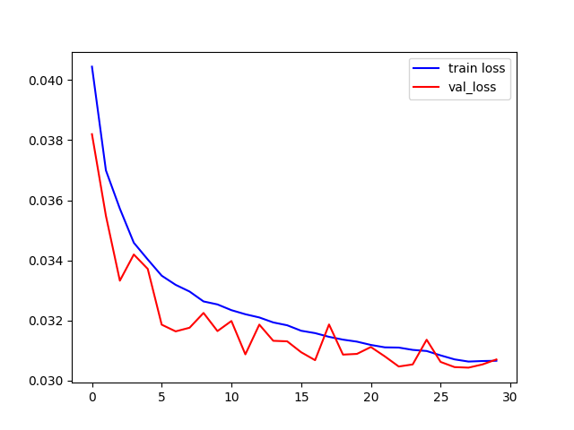

# segmentation
Here is the README.md in GitHub markdown format:

# VAE Image Segmentation

This project implements a variational autoencoder (VAE) for image segmentation. The model is trained on image datasets containing input images and corresponding segmentation masks.

## Model Architecture

The VAE model consists of:

- Encoder pathway with downsampling blocks to encode the input image into a latent representation
- Bottleneck layers to sample the latent representation  
- Decoder pathway with upsampling blocks to decode the latent representation back to the segmentation mask

The encoder and decoder pathways use convolutional, batch normalization, and ReLU activation layers. Downsampling is done using strided convolutions and upsampling with transpose convolutions.

The bottleneck samples the latent representation by predicting the mean and log variance which are used to sample the latent vector using the reparameterization trick.

## Getting Started

### Dependencies

- PyTorch >=1.9.0
- torchvision >=0.10.0
- Matplotlib >=3.4.3  
- Pillow >=8.4.0
- Numpy >=1.21.2
- tqdm >=4.62.3
- scikit-learn >=0.24.2
- scipy >=1.7.1

### Usage

- `dataset.py` - contains dataset class to load and preprocess data
- `model.py` - contains VAE model definition  
- `train.py` - script to train the model
- `test.py` - script to test the model on new images

Example usage:

```bash
# Train the model
python train.py --train_path <path_to_train_data> --val_path <path_to_val_data> --epochs 100

# Test the model 
python test.py --test_image_path <path_to_test_image> --model_path <path_to_trained_model> 
```

### Training

The model is trained to minimize the MSE loss between the predicted and ground truth segmentation masks. 

The latent representation is regularized by adding Kullback–Leibler divergence loss between the predicted posterior distribution and unit Gaussian prior.

Model checkpoints are saved after each epoch. A sample plot showing training and validation loss curves is also saved.

## Results

The model is able to segment images it has not seen during training. Some sample results on CamVid test images:




The model is able to segment relevant parts of the image while ignoring unwanted details. More rigorous quantitative evaluation can be done using segmentation metrics like IOU.
